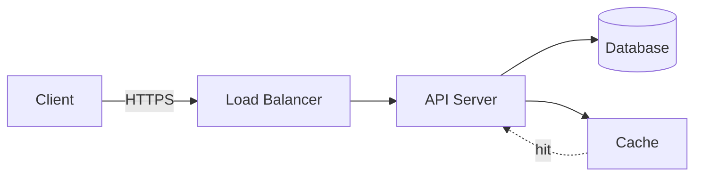

# Markdown Feature Showcase

A kitchen-sink document demonstrating headings, tables, code blocks, admonitions, lists, and more.

---

## 📑 Table of Contents

| # | Section | Highlights |
|---|---------|------------|
| 1 | [Text Formatting](#-text-formatting) | Bold, italic, strikethrough, inline code |
| 2 | [Lists & Tasks](#-lists--tasks) | Nested lists, checkboxes |
| 3 | [Code Blocks](#-code-blocks) | Syntax highlighting, diff, shell |
| 4 | [Tables](#-tables) | Alignment, wide tables |
| 5 | [Blockquotes & Callouts](#-blockquotes--callouts) | Nested quotes, GitHub alerts |
| 6 | [Links & Images](#-links--images) | References, footnotes |
| 7 | [Advanced](#-advanced) | Details/summary, math, keyboard keys |

---

## ✏️ Text Formatting

You can write **bold**, *italic*, ***bold italic***, ~~strikethrough~~, and ``inline code`` all in one sentence.

> Term definitions work too:
>
> **Markdown**
> : A lightweight markup language created by John Gruber in 2004.

## 📋 Lists & Tasks

### Unordered + Ordered mix

1. First level
   - Nested bullet
     - Even deeper
2. Second level item with `inline code`
3. Third item

### Task list

- [x] Set up project
- [x] Write documentation
- [ ] Add CI pipeline
- [ ] Ship v1.0

## 💻 Code Blocks

### TypeScript

```typescript
interface User {
  id: string;
  name: string;
  roles: Role[];
}

type Role = "admin" | "editor" | "viewer";

function isAdmin(user: User): boolean {
  return user.roles.includes("admin");
}

const users: User[] = [
  { id: "1", name: "Ada", roles: ["admin", "editor"] },
  { id: "2", name: "Linus", roles: ["viewer"] },
];

const admins = users.filter(isAdmin);
console.log(admins.map((u) => u.name)); // ["Ada"]
```

### Python

```python
from dataclasses import dataclass, field

@dataclass
class Point:
    x: float
    y: float
    tags: list[str] = field(default_factory=list)

    def distance_to_origin(self) -> float:
        return (self.x ** 2 + self.y ** 2) ** 0.5

points = [Point(3, 4, ["a"]), Point(0, 0)]
print(max(points, key=lambda p: p.distance_to_origin()))
```

### Diff

```diff
- const legacyUrl = "http://api.example.com";
+ const apiUrl = "https://api.example.com/v2";

  export const client = createClient({
-   baseUrl: legacyUrl,
+   baseUrl: apiUrl,
+   retries: 3,
  });
```

### Shell

```bash
# Install, test, and build
npm ci
npm run lint && npm test
npm run build

# Result table right in the terminal
echo -e "PASS\ttests: 42\nFAIL\ttests: 0"
```

## 📊 Tables

### Alignment showcase

| Feature | Supported | Since | Notes |
|:--------|:---------:|------:|-------|
| Left aligned | ✅ | v0.1 | Default for text |
| Center aligned | ✅ | v0.1 | Great for status |
| Right aligned | ✅ | v0.1 | Great for numbers |
| Inline `code` | ✅ | v0.2 | Works in cells |
| **Bold** headers | ✅ | v1.0 | Always bold |

### Comparison matrix

| | GitHub | GitLab | Gitea |
|---|:---:|:---:|:---:|
| Self-hosted | ❌ (Enterprise only) | ✅ | ✅ |
| Free CI minutes | 2,000/mo | 400/mo | Runner required |
| Marketplace | ✅ | ✅ | ❌ |
| License | Proprietary | MIT (CE) | MIT |

### Bundle sizes

| Package | Minified | Gzipped | Tree-shakeable |
|---------|---------:|--------:|:--------------:|
| lodash | 71.2 kB | 25.3 kB | ⚠️ Partial |
| ramda | 41.4 kB | 13.1 kB | ✅ |
| native (`Object.entries`) | 0 kB | 0 kB | ✅ |

## 💬 Blockquotes & Callouts

> Single-level quote.
>
> > Nested quote — quoting a quote.
>
> Back to the first level, with a [link](https://example.com).

> [!NOTE]
> GitHub-style alerts render as colored callouts on github.com.

> [!TIP]
> Press <kbd>Ctrl</kbd> + <kbd>C</kbd> to cancel the current command.

> [!WARNING]
> Destructive commands cannot be undone.

> [!CAUTION]
> `rm -rf` on the wrong path has ended careers.

## 🔗 Links & Images

- Inline: [The Markdown Guide](https://www.markdownguide.org)
- Referenced: [MDN][mdn] and [Can I Use][ciu]
- Auto-link: https://example.com

Images:

```markdown

```

Footnotes:

Here's a claim[^1] and another one[^longnote].

[^1]: Backed by evidence.
[^longnote]: Multi-paragraph footnotes are supported too.

[mdn]: https://developer.mozilla.org
[ciu]: https://caniuse.com

## 🧪 Advanced

### Collapsible details

<details>
<summary>Click to expand: full build output</summary>

```
vite v5.4.0 building for production...
✓ 142 modules transformed.
dist/index.html                  0.46 kB │ gzip:  0.30 kB
dist/assets/index-a1b2c3.css     8.12 kB │ gzip:  2.04 kB
dist/assets/index-d4e5f6.js    142.88 kB │ gzip: 46.31 kB
✓ built in 1.24s
```

</details>

### Math (LaTeX)

Inline: $E = mc^2$

Block:

$$
\int_{0}^{\infty} e^{-x^2} \, dx = \frac{\sqrt{\pi}}{2}
$$

### Keyboard keys & badges

Press <kbd>⌘</kbd> + <kbd>K</kbd> to open the command palette.

  

### Mermaid diagram



---

Made with plain text. Renders everywhere markdown does.
